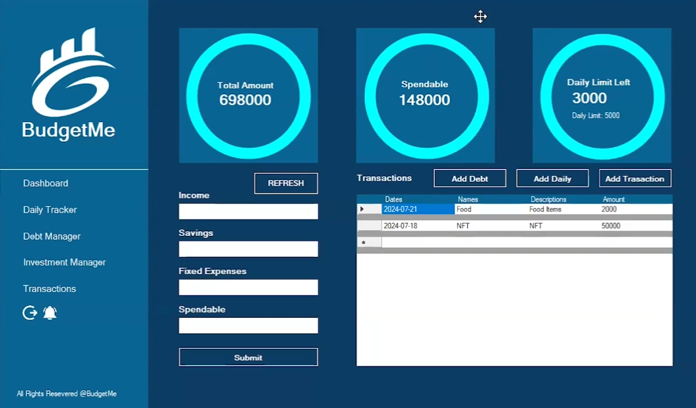
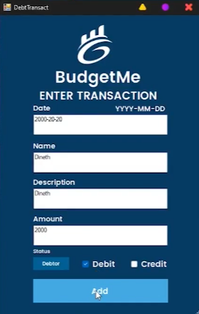

# 💰 BudgetMe - Your Personal Finance Manager

[](https://opensource.org/licenses/MIT)
[](https://docs.microsoft.com/en-us/dotnet/csharp/)
[](https://www.microsoft.com/en-us/windows)
[](https://dotnet.microsoft.com/)
[](https://www.microsoft.com/en-us/sql-server)

> Take control of your financial future with BudgetMe - a comprehensive desktop application that helps you track expenses, manage debts, monitor investments, and visualize your financial health all in one place!



## 📋 Table of Contents

- [Features](#-features)
- [System Requirements](#-system-requirements)
- [Installation Guide](#-installation-guide)
- [Usage Instructions](#-usage-instructions)
- [Project Structure](#-project-structure)
- [Database Schema](#-database-schema)
- [Screenshots](#-screenshots)
- [Technologies Used](#-technologies-used)
- [Contributing](#-contributing)
- [License](#-license)
- [Contact](#-contact)

## ✨ Features

### 🔐 User Authentication

- **Secure Login & Registration**: Protect your financial data with a personal account
- **Password Recovery**: Easily recover access to your account

### 📊 Interactive Dashboard

- **Financial Overview**: Get a comprehensive view of your total balance
- **Recent Transactions**: Quick access to your most recent financial activities
- **Visual Progress**: Circular progress bars for goal tracking and spending limits

### 💵 Daily Expense Tracker

- **Quick Entry Forms**: Efficiently log your daily expenses
- **Categorization**: Organize expenses by customizable categories
- **Real-time Updates**: Watch your spending patterns evolve as you add entries

### 💸 Debt Management

- **Debt Tracking**: Monitor all your debts in one place
- **Repayment Scheduling**: Plan and schedule your debt repayments
- **Payment Notifications**: Get alerts for upcoming payment deadlines

### 📈 Investment Portfolio

- **Investment Tracking**: Monitor your investment holdings
- **Performance Metrics**: Track the performance of your investments over time
- **Summary Views**: Get a birds-eye view of your entire investment portfolio

### 📝 Transaction Management

- **Multiple Transaction Types**: Support for debt, investment, and daily transactions
- **Detailed History**: Comprehensive transaction history with filtering options
- **Search Functionality**: Easily find specific transactions

### 📊 Data Visualization

- **Financial Health Indicators**: Visual representations of your financial status
- **Progress Tracking**: Monitor your savings and budgeting goals
- **Trend Analysis**: Analyze your spending patterns over time

## 🖥 System Requirements

- **Operating System**: Windows 10 or later
- **Processor**: 1.6 GHz or faster
- **RAM**: 2 GB minimum (4 GB recommended)
- **Disk Space**: 100 MB available
- **Framework**: .NET Framework 4.7.2 or higher
- **Database**: Microsoft SQL Server LocalDB (included with Visual Studio)
- **Display**: 1366×768 or higher resolution

## 🚀 Installation Guide

### Prerequisites

- Microsoft Visual Studio 2017 or later
- SQL Server LocalDB (comes with Visual Studio)
- .NET Framework 4.7.2 Development Tools

### Step-by-Step Installation

1. **Clone or Download the Repository**

   ```powershell
   git clone https://github.com/YOUR-USERNAME/BudgetMe.git
   cd BudgetMe
   ```

2. **Open the Solution**
   - Launch Visual Studio
   - Open `BudgetMe.sln` from the repository folder

3. **Restore NuGet Packages**
   - Right-click on the Solution in Solution Explorer
   - Select "Restore NuGet Packages"
   - Wait for the process to complete

4. **Database Configuration**
   - The application uses LocalDB with a relative path (`|DataDirectory|\BudgetMeDatabases.mdf`)
   - No manual configuration needed if using the default setup
   - All connection strings use Integrated Security (no passwords are stored in the code)

5. **Build the Solution**
   - Select Build → Build Solution (or press Ctrl+Shift+B)
   - Ensure there are no build errors

6. **Run the Application**
   - Press F5 or click the "Start" button to launch the application
   - The application will open at the Login screen

## 🎮 Usage Instructions

### First-Time Setup

1. **Create a New Account**
   - Launch the application
   - Click "Sign Up" on the login screen
   - Fill in your details and create a password
   - Click "Register" to create your account

2. **Login to Your Account**
   - Enter your username and password
   - Click "Login" to access your dashboard

### Using the Dashboard

- The dashboard provides an overview of your financial status
- Use the sidebar to navigate between different modules
- Circular progress bars visualize your budget utilization

### Tracking Daily Expenses

1. Navigate to "Daily Tracker" from the sidebar
2. Enter expense details (amount, category, description)
3. Click "Add" to record your expense
4. View your daily spending summary and remaining budget

### Managing Debts

1. Navigate to "Debt Manager" from the sidebar
2. Add new debts with creditor details and repayment plans
3. Record payments toward existing debts
4. Monitor your remaining balances and upcoming payments

### Tracking Investments

1. Navigate to "Investment" from the sidebar
2. Add your investment holdings with details
3. Update values as your investments change
4. View performance metrics and summary data

### Recording Transactions

1. Select the appropriate transaction type from the menu
2. Fill in the required details for the transaction
3. Save the transaction to update your financial records

## 📁 Project Structure

The BudgetMe project follows a standard Windows Forms application structure:

```markdown
BudgetMe/
├── BudgetMe.sln                # Solution file
├── README.md                   # Project documentation
├── SQLQuery1.sql               # Database queries
├── BudgetMe/                   # Main project folder
│   ├── App.config              # Application configuration
│   ├── BudgetMe.csproj         # Project file
│   ├── Database Files          # LocalDB database files (not included in repo)
│   ├── Program.cs              # Application entry point
│   ├── Form Files              # Windows Forms (.cs, .Designer.cs, .resx)
│   │   ├── Login.cs            # Login screen
│   │   ├── Signup.cs           # Registration screen
│   │   ├── AllDash.cs          # Main dashboard
│   │   ├── DailyTracker.cs     # Expense tracking
│   │   ├── DebtManager.cs      # Debt management
│   │   ├── Investment.cs       # Investment tracking
│   │   ├── Transaction.cs      # Transaction management
│   │   └── ...                 # Other form files
│   ├── Properties/             # Project properties
│   ├── Resources/              # Application resources
│   ├── bin/                    # Binary output
│   └── obj/                    # Object files
└── packages/                   # NuGet packages
```

## 🗃 Database Schema

BudgetMe uses a SQL Server LocalDB with the following main tables:

### Users Table

- Stores user authentication information and profile data
- Primary key: UserID
- Fields: Username, Password, Email, etc.

### Transactions Table

- Records all financial transactions
- Primary key: TransactionID
- Fields: UserID (FK), Amount, Type, Category, Date, Description

### Debts Table

- Tracks debt information
- Primary key: DebtID
- Fields: UserID (FK), Creditor, Amount, Interest, DueDate, Status

### Investments Table

- Manages investment holdings
- Primary key: InvestmentID
- Fields: UserID (FK), Name, Amount, PurchaseDate, CurrentValue

### Daily Expenses Table

- Records day-to-day spending
- Primary key: ExpenseID
- Fields: UserID (FK), Date, Category, Amount, Description

## 📸 Screenshots

### Main Dashboard


### Transaction Management



### Other Screens

*More screenshots will be added as the application is developed further.*

## 🛠 Technologies Used

- **C#**: Primary programming language
- **.NET Framework 4.7.2**: Application framework
- **Windows Forms**: UI framework
- **SQL Server LocalDB**: Database
- **ADO.NET**: Data access
- **CircularProgressBar**: Visual component for progress tracking
- **BouncyCastle.Cryptography**: Security components
- **Various .NET Libraries**: For additional functionality

## � Setup Instructions for Contributors

### Database Setup

Since the database files (`.mdf` and `.ldf`) are not included in the repository for security and size reasons, you'll need to initialize your own database:

1. **Create a New Database**
   - The application is configured to look for `BudgetMeDatabases.mdf` in the application directory
   - Visual Studio will automatically create this file when you run the application for the first time

2. **Initialize Database Schema**
   - Execute the SQL queries in `SQLQuery1.sql` to set up the required tables
   - Alternatively, the application can auto-create tables on first run

### .gitignore Configuration

This repository uses a `.gitignore` file to prevent committing sensitive or unnecessary files:

- Database files (`.mdf`, `.ldf`)
- Compiled binaries (`bin/`, `obj/`)
- User-specific settings (`.suo`, `.user`)
- NuGet packages (`packages/`)

## �👨‍💻 Contributing

Contributions to BudgetMe are welcome! Here's how you can contribute:

1. **Fork the Repository**
   - Create a fork of this project to your GitHub account

2. **Create a Branch**

   ```powershell
   git checkout -b feature/your-feature-name
   ```

3. **Make Changes**
   - Implement your feature or fix
   - Ensure code follows existing style patterns

4. **Test Your Changes**
   - Verify your changes work as expected
   - Check for any potential issues

5. **Submit a Pull Request**
   - Create a PR with a clear description of your changes

## 📄 License

This project is licensed under the MIT License - see the [LICENSE](LICENSE) file for details.

[](https://opensource.org/licenses/MIT)


⭐ **Star this repository if you find it useful!** ⭐

> Last Updated: August 25, 2023
